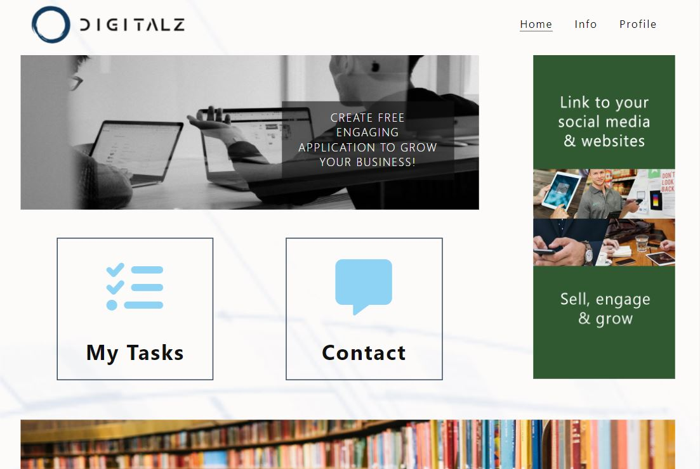

Welcome!


The idea is to develop a digital solution for SME or non-profits where they can, without any investment into development or licenses, equip themselves with crowdfunding, crowdsourcing and e-commerce tools to run and grow their business. It has been my experience from the last 7 years that such solution would be very relevant and in demand (one of the potential cleints would be "DKIRU", starting field operation in Mexico). This thought is supported by 2021-2027 EU initiative #AStrongerigitalEurope where the aim is to dramatically increase the use of digital tools and data usage for the growth of Small & Medium Enterprises (SMEs).

Typically, a start-up, a small company or an association have a great idea, publish a facebook or business website and even connect to the e-commerce solution. However, the engagement from the business partners remain very low, because many tools are passive and you have to use several of them (WhatsApp, Facebook, Kickstarter, Shopify and a few more) to achieve the business impact. DigitaZ should be a unifying platform with several unique features that satisfy most of the business engagement needs in one platform.

The initial sceleton of the platform (static several pages, made with html & css) can be found [here](https://zilvaro.github.io/my-digitalz/index.html).


This project is the HTML and CSS based functional core structure of the solution working as a teaser and allowing interested people to request more information. By adding more elements in JavaScript and Python later it will become more functional, easier-to-use and beneficial for different users.

## Table of Contents

# 1. User Experience (UX) & Interface (UI)

##1.1 General Rules
[Go to the top](#table-of-contents)

While designing the functionality & user experience there were applied some guiding principles:
- 5 seconds rule: it has to be clear what the page is for in 5s (is it just for information, to perform an activity or leave a comment) and where to go next
- 2 clicks rule: user shall get to any core functionality (perform a task, order product, check the points balance, leave a m * call-to-action: at every page or stage there is an invitation "to do something" (contact, order, donate, perform a task or follow to instruction section).
- consistency: every page has the same color scheme, similar structure, button design and follows a common practice of app design (OK buttons - green, main page - home, settings - in profile, etc.)


## 1.2 Personas

Alex : 25 years old sustainable business owner. He is promoting reusability and sharing, so he provides refillable containers for food products, supplies quality produce from different parts of the world and organizes communal workshops about circular economy. In addition to his facebook and Instagram accounts he would like to have an application where he can check the display and stock level in partner stores, activate on-line store and run continuous crowdfunding activities to support the business.  

Marion : 42 years old grocery store manager that is looking how to improve the sales and make extra revenues for additional services. She is busy at the store, so is not in favour with visiting salesmen and merchandizers so for her the contractual tasks and communication with suppliers would be ideal if they happen at her own schedule. And posibility to have a personalized discount on supplies or extra revenue from performing some merchandising services would be very appreciated.


## 1.3 Color Scheme

The idea of the solution is that ad-banners, product pictures or story-images will be very colorful, therefore core color scheme was chosen to be calm, cool, but not cold.

With the help of https://www.color-hex.com/color-palettes/ DigitalZ has the color combination that guaranties sufficient contrast, readibility and enough supporting colors to be engaging:


Font-family is standard, looking great on multiple browsers: 'Segoe UI', sans-serif.


## 1.4 Structure (Flow)

###Wireframes
To visualize the ideas and define the prioriies for the development BALSAMIQ tool was used. At first, larger (not full) site architecture was created, then prioritized what would be possible to do just with html and css, but already be a functional site and give a solid structure for the next upgrades.

It was designed with both personas' interests in mind:
- on the home-page: advertizing banners & money making actions - tasking & e-store (currently replaced by Contact link)
- within advertizing/info pages: promo or instructional materials with a link to action
- contact page: it is a form for giving the posibility to contact the solution operator and collecting info about the user (before proper log-in/sign-up form is developed)

Then, the concept pages for mobile and wide-screen were designed:

####Site-map


####Home-page


####Info-blog


####Contact-registration


# 2.Features


# 2.1 Navigation

To increase site's accessibility and clarity 4 navigation elements were used:

1. Top-navigation menu for screens wider than 600px 
2. Bottom-navigation menu for screens bellow 600px width. Bottom nav is in the fixed-bottom position to be always accessible. 
3. Middle page 2-button selection on the home-screen to core action-features: tasking & e-store (currently replased with Contact) 
4. 'Breadcrumbs' on some internal pages with more related content (currently Info/article pages)

On top-nav and bottom-nav a pseudo-element :hover applied to attract the attention to user-actions and possibilities.

DigitalZ logo from each page always returns a user to the home-page.

# 2.2 Banners/Images

Banners and images on the home page are the eye-catchers for the products, instructions, services or promotions. Those will be used as free or paid advertisement banners linking to further content or action pages.

To keep the consistent design, but allow some flexibility there are two options to createfor banners:

1. Flex box structure, where user (app admin) has fixed space, structure and design. Then he/she only changes the background image, text and link to futher material or site, e.g e-store's specific product page.
2. Image placement as a banner. In case user has a special design neeeds and prepares image, say using Photoshop, it is possible to upload just that. (This choice will be implemented when back-end functionality is live).

For the better appeal and user experience, the flow of the banners is different on small and large screens. In order not to have oversized buttons on large screens, the ASIDE banner is introduced. It moves into normal flow on small (less than 600px) screens.
It uses 2 different banners, adjusted to match overall page style for better impact.


# 2.3 Info/Blog

Info/blog section is to provide user with extra information or instructions before asking to take an action. It preferably has rigid structure:

- header line that separates from the logo and nav, and indicates what is this page (including 'breadcrumbs' where relevant)
- photo, reflecting the purpose or content of the text
- heading h1 text
- summary text, that acts as a teaser to read more
- text space, that has article structure of sections (with h3/h4 headings), lists of items.
- call to action, where relevant, e.g Contact or Order.
- copyright line, where relevant, e.g Privacy Policy page. 


# 2.4 Contact/Registration

Contact form is made with fixed width to have a consistent look across different screen sizes. In screens over 600px, the filler-background-image is added for a better visual look.

Message-box has overflow:auto attribute to create a scroll bar for better visibility if a text doesn't fit into the allocated field.

Used :hover selector to highlight the input field if mouse is hovered over the input field 
Used :focus selector to highlight the input field when it gets clicked.




# 2.5 Features-to-come (list is not complete)

Those features and some more are the integral part of completed DigitalZ solution and they will be build later with a knowledge outside html and css.

1. Log-in/Sign-on 
2. Task creation, execution & approval. !Note: MyTasks and e-store (Contact) buttons are included to the project at this stage, because they are structurally critical for the application. The true functionality will be added at the later stage (JavaScript/Python)
3. Sharing: to allow user to share screen with friends 
4. Community selection 
5. Points management
6. E-store


------

## FAQ about the uptime script

**Why have you added this script?**

It will help us to calculate how many running workspaces there are at any one time, which greatly helps us with cost and capacity planning. It will help us decide on the future direction of our cloud-based IDE strategy.

**How will this affect me?**

For everyday usage of Gitpod, it doesn’t have any effect at all. The script only captures the following data:

- An ID that is randomly generated each time the workspace is started.
- The current date and time
- The workspace status of “started” or “running”, which is sent every 5 minutes.

It is not possible for us or anyone else to trace the random ID back to an individual, and no personal data is being captured. It will not slow down the workspace or affect your work.

**So….?**

We want to tell you this so that we are being completely transparent about the data we collect and what we do with it.

**Can I opt out?**

Yes, you can. Since no personally identifiable information is being captured, we'd appreciate it if you let the script run; however if you are unhappy with the idea, simply run the following commands from the terminal window after creating the workspace, and this will remove the uptime script:

```
pkill uptime.sh
rm .vscode/uptime.sh
```

**Anything more?**

Yes! We'd strongly encourage you to look at the source code of the `uptime.sh` file so that you know what it's doing. As future software developers, it will be great practice to see how these shell scripts work.

---

Happy coding!
