# Welcome!

The idea is to develop a digital solution for SME or non-profits where they can, without any investment into development or licenses, equip themselves with crowdfunding, crowdsourcing, and e-commerce tools to run and grow their business. It has been my experience from the last 7 years that such solution would be very relevant and in demand (one of the potential clients would be "DKIRU", starting field operation in Mexico). This thought is supported by 2021-2027 EU initiative #AStrongerigitalEurope where the aim is to dramatically increase the use of digital tools and data usage for the growth of Small & Medium Enterprises (SMEs).

Typically, a start-up, a small company or an association have a great idea, publish Facebook or business website and even connect to an e-commerce solution. However, the engagement from the business partners remains very low, because many tools are passive and you have to use several of them (WhatsApp, Facebook, Kickstarter, Shopify and a few more) to achieve the business impact. DigitalZ should be an unifying platform with several unique features that satisfy most of the business engagement needs in one platform.

The working version of the mobile-web pages (static several pages, made with html & CSS) can be found [here](https://zilvaro.github.io/my-digitalz/index.html).

This project is the HTML and CSS based functional core structure of the solution that works as a teaser and allows people to request more information. By adding more elements in JavaScript and Python later it will become more functional, easier-to-use, and beneficial for different users.

# Table of Contents

[1. User Experience (UX) & Interface (UI)](#ux)
  - [1.1 General Rules](#general-rules)
  - [1.2 Personas](#personas)
  -	[1.3 Color Scheme](#color-scheme)
  - [1.4 Structure (Flow)](#wire-flow)
    - [Wireframes](#wireframes)
    - [Site-map](#wire-site-map)
    - [Home-page](#wire-home)
    - [Info-blog](#wire-info)
    - [Contact-registration](#wire-contact)

      
[2. Features](#features)
  - [2.1 Navigation](#navigation)
  - [2.2 Banners/Images](#banners)
  -	[2.3 Info/Blog](#info)
  - [2.4 Contact/Registration](#contact)
  - [2.5 Profile](#profile)
  - [2.6 Features-to-come (list is not complete)](#future-features)

[3.Technologies used](#technologies-used)
  - [Languages Used](#languages-used)
  - [Frameworks, Libraries and Programs Used](#programs-used)
  

[4.Testing](#testing)
  - [Flow Testing](#flow-testing)
  - [Performance Testing](#performance-testing)

[5. Deployment](#deployment)

[6. Acknowledgement](#acknowledgement)

 

# 1.User Experience (UX) & Interface (UI)
[Go to the top](#table-of-contents)

## 1.1 General Rules
[Go to the top](#table-of-contents)

While designing the functionality & user experience there were applied some guiding principles:
- 5-seconds rule: it has to be clear what the page is for in 5s (e.g. is it just for information, to perform an activity or leave a comment) and where to go next
- 2 clicks rule: user shall get to any core functionality (perform a task, order product, check the points balance, leave a message. etc.) by maximum two browsing/clicking steps.  
- call-to-action: at every page or stage there is an invitation "to do something" (contact, order, donate, perform a task or follow to instruction section).
- consistency: every page has the same color scheme, similar structure, button design and follows a common practice of app design (OK buttons - green, main page - home, settings - in profile, etc.).

The screen-max-width is set for 1100px to keep all the items in proportion. To keep all elements visually complete and related to each other, a light background was added that is always responsive to full screen size (not only up to 1100px).

## 1.2 Personas
[Go to the top](#table-of-contents)

**Alex** : 25 years old sustainable business owner. He is promoting reusability and sharing, so he provides refillable containers for food products, supplies quality produce from different parts of the world and organizes communal workshops about circular economy. In addition to his Facebook and Instagram accounts he would like to have an application where he can check the display and stock level in partner stores, activate on-line store and run continuous crowdfunding activities to support the business.  

**Marion** : 42 years old grocery store manager that is looking how to improve the sales and make extra revenues for additional services. She is busy at the store, so is not in favour with visiting salesmen and merchandizers so for her the contractual tasks and communication with suppliers would be ideal if they happen at her own schedule. And possibility to have a personalized discount on supplies or extra revenue from performing some merchandising services would be very appreciated.

## 1.3 Color Scheme
[Go to the top](#table-of-contents)

The idea of the solution is that ad-banners, product pictures or story-images will be very colorful, therefore core color scheme was chosen to be calm, cool, but not cold.

With the help of https://www.color-hex.com/color-palettes/ DigitalZ has the color combination that guaranties sufficient contrast, readability and enough supporting colors to be engaging:

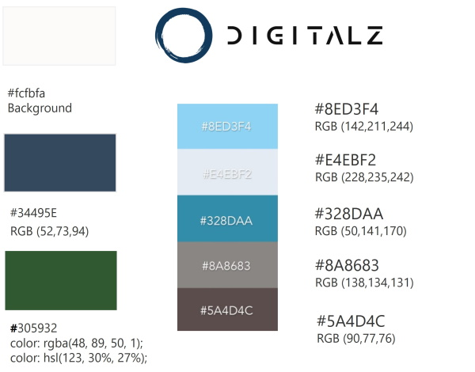

Font-family is a standard one, that looks great on multiple browsers: **'Segoe UI', sans-serif**.

## 1.4 Structure (Flow)
[Go to the top](#table-of-contents)

### Wireframes
[Go to the top](#table-of-contents)

To visualize the ideas and define the priorities for the development BALSAMIQ tool was used. At first, larger (not full) site architecture was created, then prioritized what would be possible to do just with html and CSS, but already be a functional site and give a solid structure for the next upgrades.

It was designed with both personas' interests in mind:
- on the home-page: advertising banners & money making actions - tasking & e-store (currently replaced by Contact link)
- within advertising/info pages: promo or instructional materials with a link to action
- contact page: it is a form for giving the possibility to contact the solution operator and collecting info about the user (before proper log-in/sign-up form is developed)

Then, the concept pages for mobile and wide-screen were designed:

### Site-map
[Go to the top](#table-of-contents)

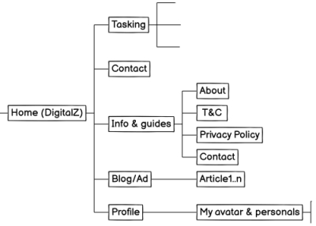

### Home-page
[Go to the top](#table-of-contents)

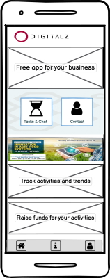
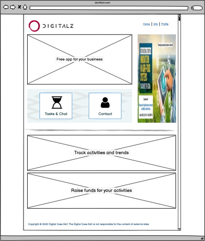

### Info-blog
[Go to the top](#table-of-contents)

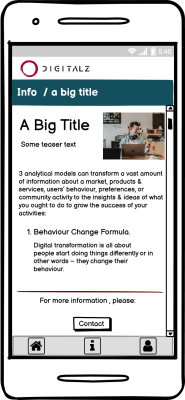
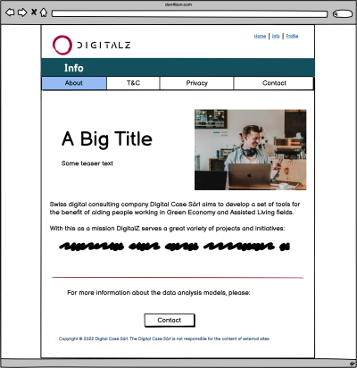

### Contact-registration
[Go to the top](#table-of-contents)

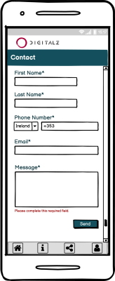
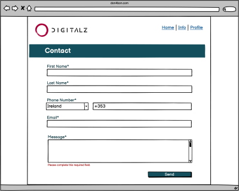

# 2.Features
[Go to the top](#table-of-contents)

## 2.1 Navigation
[Go to the top](#table-of-contents)

To increase site's accessibility and clarity 4 navigation elements were used:

1. Top-navigation menu for screens wider than 600px 
2. Bottom-navigation menu for screens bellow 600px width. Bottom nav is in the fixed-bottom position to be always accessible. 
3. Middle page 2-button selection on the home-screen to core action-features: tasking & e-store (currently replaced with Contact) 
4. 'Breadcrumbs' on some internal pages with more related content (currently Info/article pages)

On top-nav and bottom-nav a pseudo-element :hover applied to attract the attention to user-actions and possibilities.

DigitalZ logo from each page always returns a user to the home-page.

 
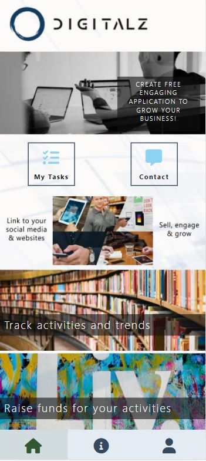 
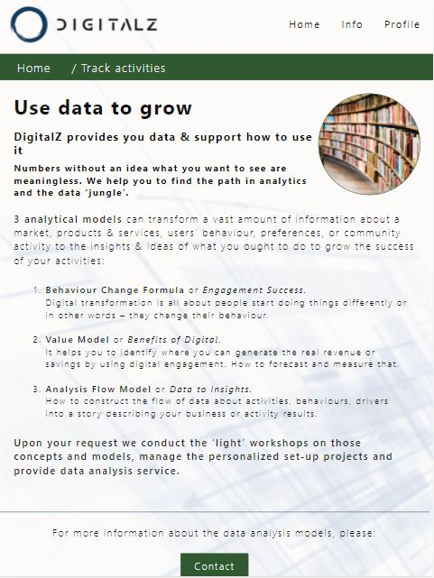

## 2.2 Banners/Images
[Go to the top](#table-of-contents)

Banners and images on the home page are the eye-catchers for the products, instructions, services or promotions. Those will be used as free or paid advertisement banners linking to further content or action pages.

To keep the consistent design, but allow some flexibility there will be two options to create banners:

1. Flex box structure, where user (app admin) has fixed space, structure and design. Then he/she only changes the background image, text and link to further material or site, e.g. e-store's specific product page.
2. Image placement as a banner. In case user has a special design needs and prepares image, say using Photoshop, it is possible to upload just that. (This choice will be implemented when back-end functionality is live).

For the better visual appeal and user experience, the flow of the banners is different on small and large screens. In order not to have oversized buttons on large screens, the ASIDE banner is introduced. It moves into normal flow on small (less than 600px) screens.
It uses 2 different banners, adjusted to match overall page style for better impact.

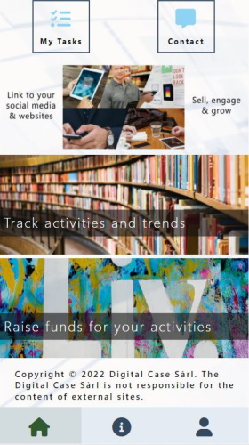 
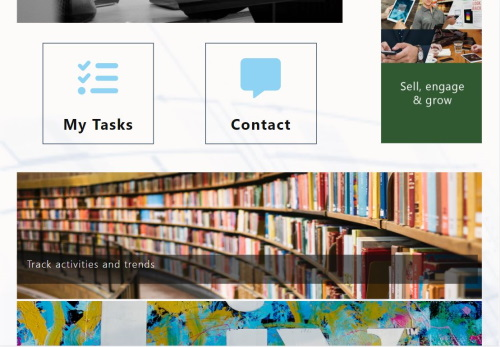 

## 2.3 Info/Blog
[Go to the top](#table-of-contents)

Info/blog section is to provide user with extra information or instructions before asking to take an action. It preferably has rigid structure:

- header line that separates an article from the logo and nav, and indicates what is this page (including 'breadcrumbs' where relevant)
- photo, reflecting the purpose or content of the text
- heading h1 text
- summary text, that acts as a teaser to read more
- text block, that has "article" structure of sections (with h3/h4 headings), lists of items.
- call to action, where relevant, e.g. Contact or Order.
- copyright line, where relevant, e.g. Privacy Policy page. 

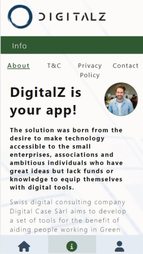 
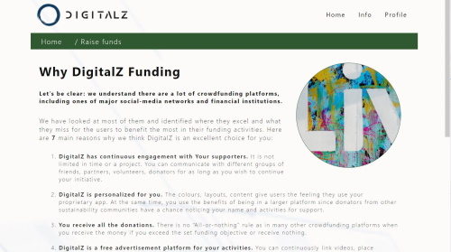 

## 2.4 Contact/Registration
[Go to the top](#table-of-contents)

Contact form is made with fixed width to have a consistent look across different screen sizes. In screens over 600px, the filler-background-image is added for a better visual look.

Message-box has overflow:auto attribute to create a scroll bar for better visibility if a text doesn't fit into the allocated field.

Used **:hover** selector to highlight each input field if mouse is hovered over it.

Used **:focus selector** to highlight each input field when it gets clicked.

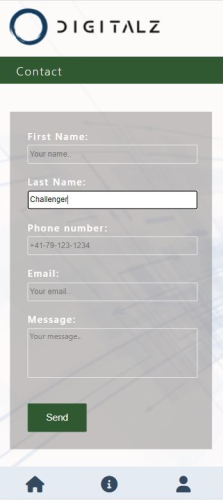
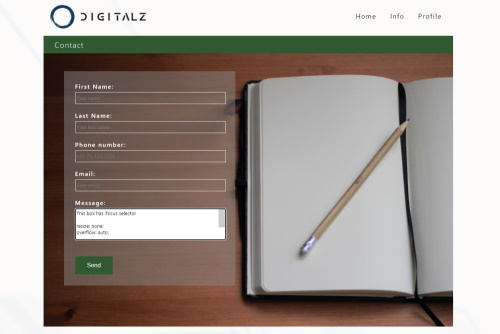

## 2.5 Profile
[Go to the top](#table-of-contents)

Profile, ultimately, will be a place with all the settings (language, community, personal info...) and activity review (points/wallet, orders, leader-board... ).
At this stage, because all of the above are not functioning, it is all about the developer's info (!image - from unsplashed.com):

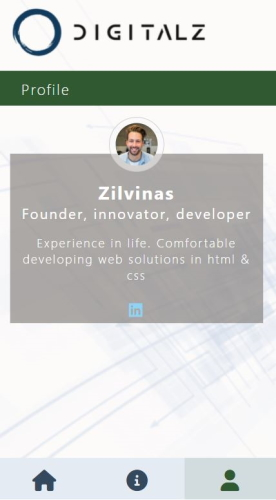
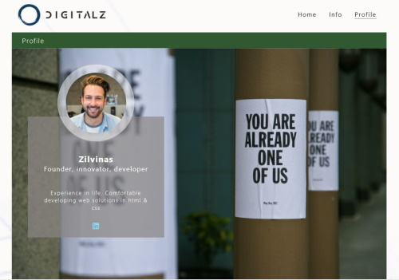

## 2.6 Features-to-come (list is not complete)
[Go to the top](#table-of-contents)

Those features and some more are the integral part of completed DigitalZ solution and they will be build later with a knowledge outside html and CSS.

1. Log-in/Sign-on 
2. Task creation, execution & approval. !Note: MyTasks and e-store (Contact) buttons are included to the project at this stage, because they are structurally critical for the application. The true functionality will be added at the later stage (JavaScript/Python)
3. Sharing: to allow user to share screen with friends 
4. Community selection 
5. Points management
6. E-store

------

# 3.Technologies Used
[Go to the top](#table-of-contents)

## Languages Used

- HTML5 (markup language) was used for structuring and presenting content of the website.

- CSS3 (Cascading Style Sheets) was used to provide the style to the content written in a HTML.

## Frameworks, Libraries and Programs Used

- Balsamiq was used to create wireframes of the website (mobile-first and wide-screen versions).

- Paint.net was used to resize some of the images used.

- Font Awesome was used to import icons.

- Chrome was used to test the source code using HTML5 and responsiveness.

- GitHub was used to create the repository and to store the project's code.

- Gitpod was used as the Code Editor for the site

- ColorHex was used to select the color-palette for the website.

- W3C Markup and Jigsaw validation tools were used to validate the HTML code and CSS style used in the project.

- Looka was used to generate the DigitalZ logo design

- Unsplash.com was used to choose the images for the website

# 4.Testing
[Go to the top](#table-of-contents)

The W3C Markup Validator, W3C CSS Validator and W3C Link Checker were used to validate every page and links of the project to ensure there were no syntax errors in the project.

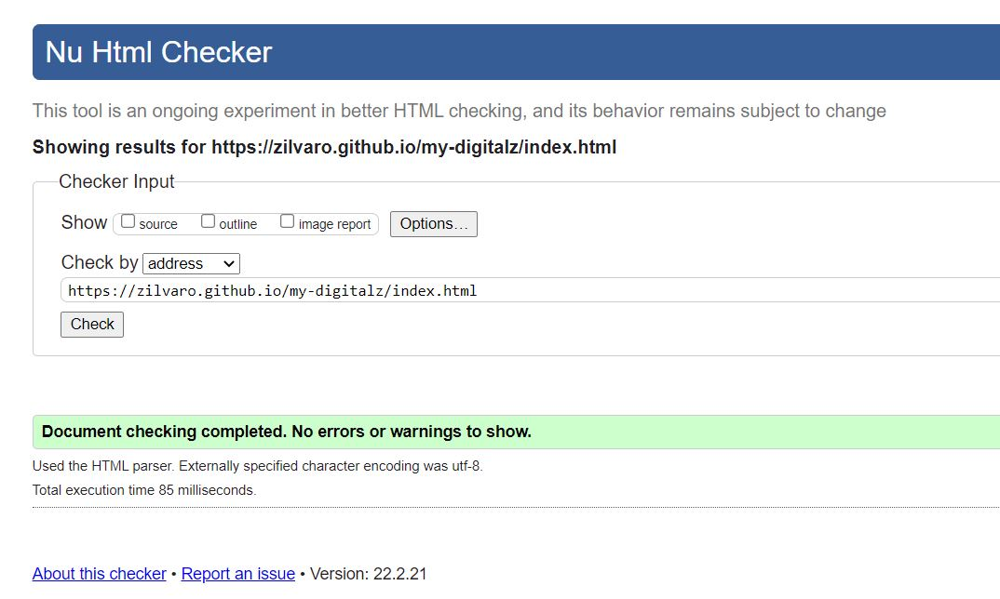
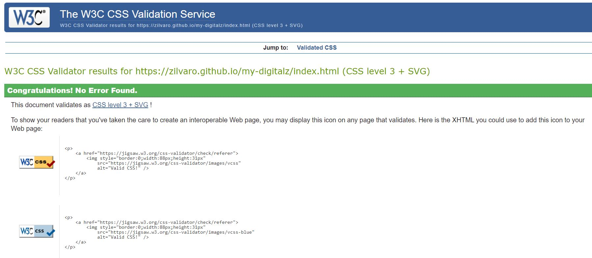
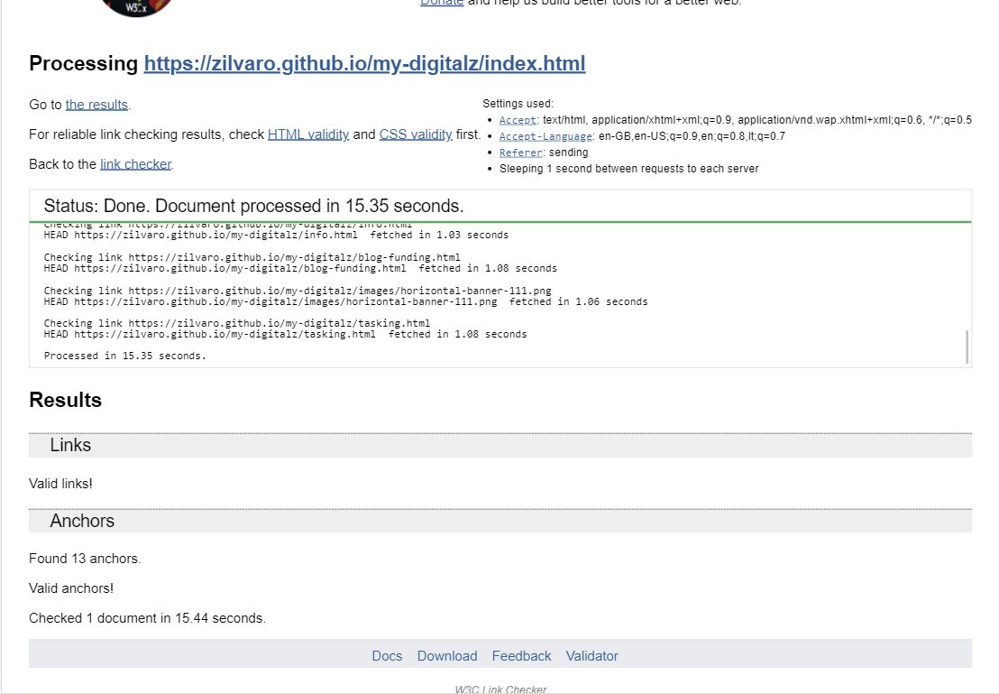

## Flow Testing
[Go to the top](#table-of-contents)

After every significant iteration, the code was tested using Chrome Developer tools and on several devices:

- Nokia8 mobile phone
- Samsung S5e tablet
- Dell XPS 13" wide (9x16) laptop 
- Samsung 24" regular (10x16) screen monitor

Each of the pages were tested for 
1. responsiveness + smooth change from vertical to horizontal layout
2. all images and texts are clear, readable and are not distorted on different screens
3. all links to other pages work 
4. accessibility (clarity of the page and next steps)
5. external links open in new tab and
6. the flow in general 

ALL tests PASSED.

Plus, it was tested the form (Contact) functionality (if it checks the correct inputs and submits the values entered):

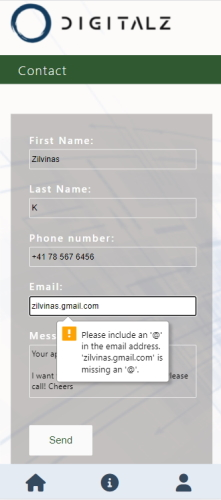
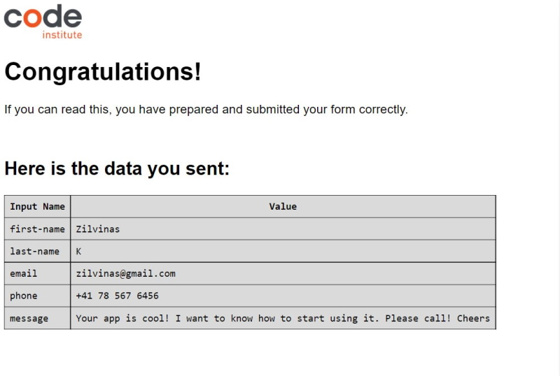

---

One bug was observed in the MyTask page with incorrect block alignment (the bottom div-block was hidden beneath the top one). It was fixed by using Chrome Developer tool and removing position:absolute :

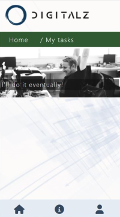
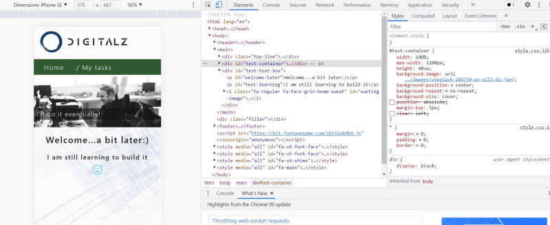

## Performance Testing
[Go to the top](#table-of-contents)

Test was performed Chrome-Developer tools-Lighthouse test for all pages in mobile and desktop version. Some problems initially were on the home-page and privacy-policy pages.

### Home page
[Go to the top](#table-of-contents)

The performance was on the low side mainly due to the size of the images. By resizing all of them and changing the format to AVIF or WebP, the issue was fixed. To learn more about the correct formats (transparency was needed on one of the images), avif.io/blog/comparisons/avif-vs-png/ information was used.

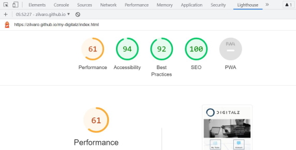
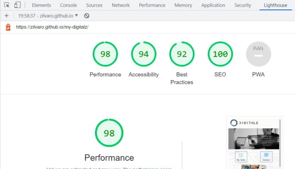

### Info / Privacy Policy
[Go to the top](#table-of-contents)

The second most problematic page was Privacy Policy. It was mainly to incorrect syntax at the end of 2 li (list) lines. It was also added the meta-description and alt-attributes to the anchor elements.

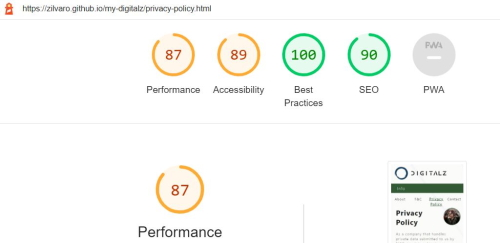
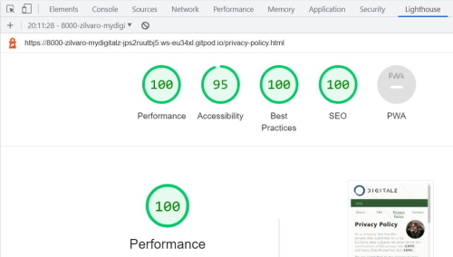

### Info-main page
[Go to the top](#table-of-contents)

No major issues

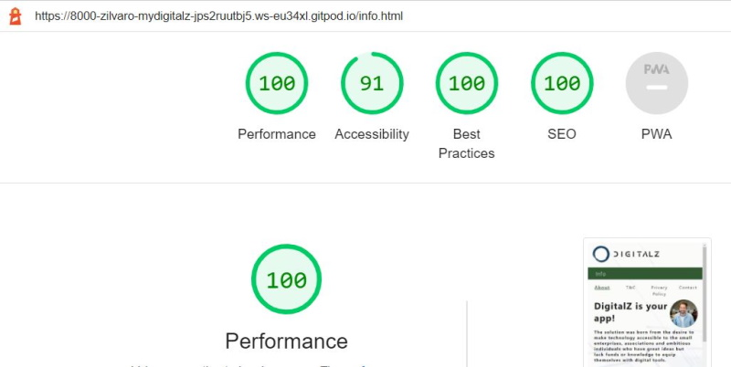

### Contact Form
[Go to the top](#table-of-contents)

No major issues

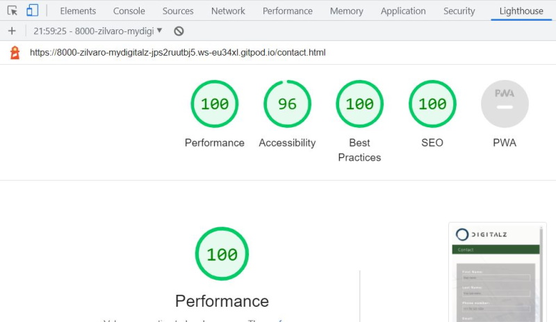

### Profile page
[Go to the top](#table-of-contents)

No major issues

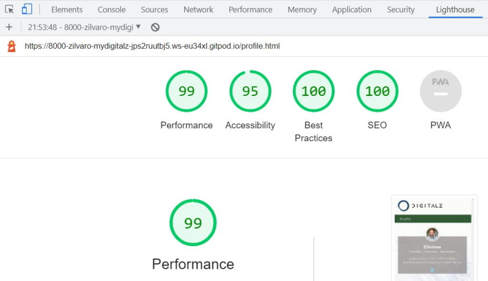

### MyTasks page
[Go to the top](#table-of-contents)

No major issues

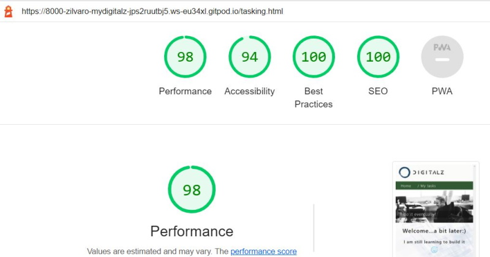

# 5.Deployment
[Go to the top](#table-of-contents)

The site was deployed to GitHub pages using the following steps:
- Sign up to GitHub
- Create a new repository on GitHub.
- Click on settings on the navigation bar under the repository title.
- Select pages on the left menu bar.
- Click on the master branch and save.
- This will now generate a link with your website live.
- The live link can be found here - https://zilvaro.github.io/my-digitalz/

# 6.Acknowledgement
  [Go to the top](#table-of-contents)

- For README.md file/Deployment section, reference of github.com/iKelvvv/MS1 was considered.
- The code was created by developer with some theory and concepts explanations by W3C and HubSpot blog.
- The texts were created by developer with pictures sourced from unsplash.com

* Thanks to my mentor Marcel Mulders for his constructive feedback and guidance.

------

